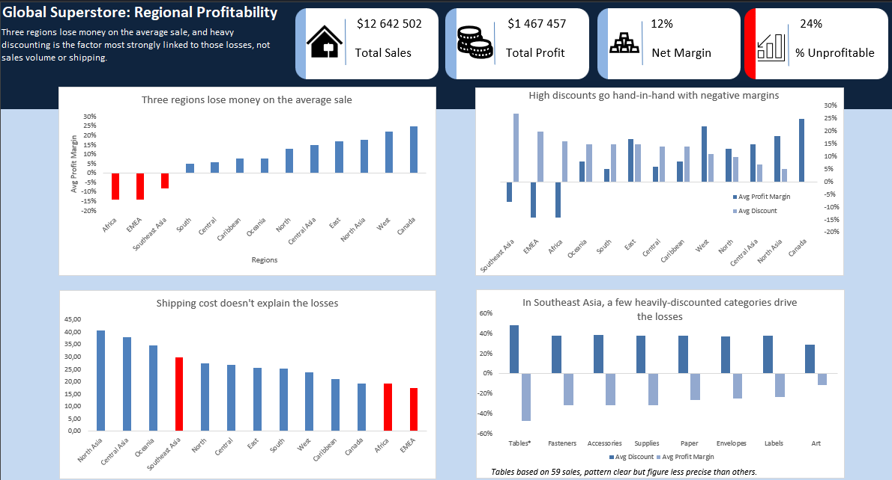

# Global Superstore: Regional Profitability Analysis

Tools: Microsoft Excel, using XLOOKUP, PivotTables, calculated fields, and filtering and sorting.

Dataset: Global Superstore, with around 51,000 order line items across 13 global regions covering 2011 to 2014.

---

## Brief

Global Superstore is a global online retailer with a broad product catalogue spanning office supplies, furniture, and technology, selling to customers across many countries. Like any retailer, it wants sales that actually convert into profit. This project takes the role of an analyst asked to find where the business loses money, and why, and to test that explanation rather than stop at the first pattern.

## Objective

Sales were growing, but profit was not keeping pace. The guiding question:

**Where does Global Superstore lose money across its regions, and what is actually driving those losses?**

## The headline finding

**Three regions lose money on the average sale, and heavy discounting is the factor most strongly linked to those losses, not sales volume or shipping.**

---

## Dashboard

---

## Key insights and recommendations

**1. Losses are concentrated in three regions, not spread across the business.**
Africa, EMEA, and Southeast Asia run negative average profit margins, while the other ten regions stay profitable. The business stays positive overall only because the healthy regions absorb these losses.
*Recommendation: treat these three regions as the priority for pricing and discount review.*

**2. Heavy discounting is the factor most strongly linked to the losses.**
The three loss making regions carry the highest average discounts (16 to 27 percent), while the healthiest region, Canada, discounts nothing and holds the strongest margin. Across all 13 regions, deeper discounts line up with worse margins.
*Recommendation: cap discounts in the affected regions for one quarter and measure whether margins recover before making it permanent.*

**3. Shipping is not the cause, which sharpens where to act.**
Both shipping cost and shipping delay were tested, and neither aligns with the losses. Africa and EMEA in fact have the lowest shipping costs in the company yet still lose money. This rules out shipping and points the focus directly at discounting.

**4. In Southeast Asia, the damage is surgical, not region wide.**
Unlike Africa and EMEA, where every category is unhealthy, Southeast Asia is mostly profitable apart from a few heavily discounted categories (Tables, Accessories, Supplies, Fasteners) that drag the whole region negative.
*Recommendation: target discount limits at these specific categories rather than the entire region, and confirm local demand before restocking.*

---

## Approach

1. **Cleaned and validated the data.** Confirmed the dates were stored as text and converted them to real dates, then built two calculated fields: profit margin (Profit ÷ Sales) and shipping delay (Ship Date − Order Date). Checked for duplicate rows across all columns (none found).
2. **Mapped targets onto the data.** Built a small reference table assigning each region a profit margin target, then used XLOOKUP to pull those targets onto every row so actual margins could be judged against a goal.
3. **Tested the hypothesis with PivotTables.** Compared total profit, sales, average margin, and average discount across regions to locate the losses and test whether discounting explained them.
4. **Ruled out alternatives.** Tested shipping delay and shipping cost against the weak regions to check whether shipping, rather than discounting, drove the losses. It did not.
5. **Drilled into products.** Broke the problem regions down by sub-category to find where the losses concentrate, and confirmed the most extreme finding against its sales volume before reporting it.

---

## Data dictionary (key fields used)

| Field | Description |
|---|---|
| Order ID | Unique identifier for each order. One order can span several rows (one row per product line). |
| Order Date / Ship Date | When the order was placed and shipped; used to calculate shipping delay. |
| Sales | Revenue for the line. Misleading on its own, since high sales can still lose money. |
| Profit | Financial gain or loss on the line. Can be negative. |
| Discount | Price reduction applied. The factor most strongly linked to the losses. |
| Category / Sub-Category | Product groupings used to locate which products drive losses. |
| Region | Broad geographic area (13 in total); the main dimension of this analysis. |
| Shipping Cost | Cost to ship the order; tested as an alternative explanation and ruled out. |

*Calculated fields added during analysis: Profit Margin (Profit ÷ Sales), Shipping Delay (Ship Date − Order Date), and Target Margin / Manager (mapped from a reference table via XLOOKUP).*

---

## Scope and limitations

- **Correlation, not proven causation.** Discounting is the factor most strongly associated with the losses, but only a limited set of explanations was tested. Discount and losses move together; discount is not claimed as the sole or definitive cause.
- **Short time window.** The data spans only four years (2011 to 2014), too short to confirm whether regional profitability is genuinely improving or declining. The flat overall trend is suggestive, not conclusive.
- **No visibility into external factors.** The dataset holds no information on regional economies, customer behavior, or pricing strategy, so explanations such as local economic conditions or deliberate loss leaders cannot be tested and are not claimed.
- **Assumed targets.** The regional profit margin targets used were reasonable assumptions set for practice, not actual company figures. Any judgment of a region hitting or missing target depends on those assumptions.
- **Averages can hide variation.** Regional and category figures are averages; the Tables result in Southeast Asia rests on only 59 sales, so its precise figure is less reliable than higher volume categories, though the direction is clear.
- **Analysis level.** The discount to loss relationship was confirmed on regional and category averages, not verified sale by sale.

---

## Skills applied

Data cleaning and validation • Calculated fields • XLOOKUP and data mapping • PivotTables • Filtering and sorting • Hypothesis testing and ruling out alternatives • Translating analysis into business recommendations • Communicating findings honestly with stated limitations
